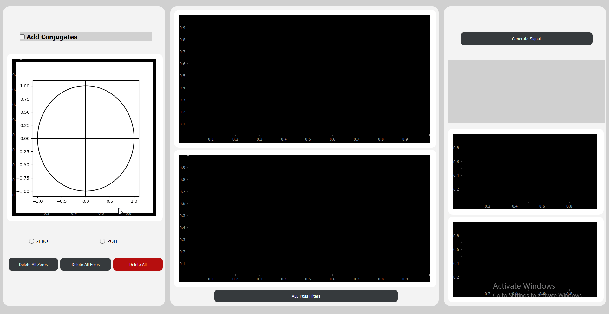
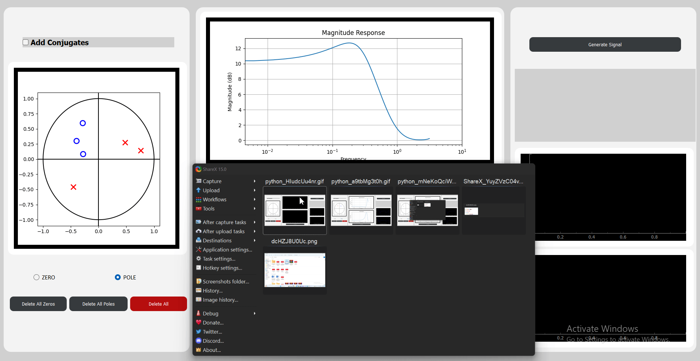
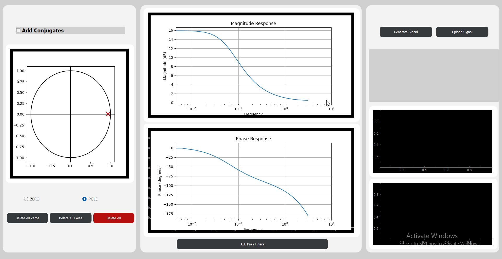
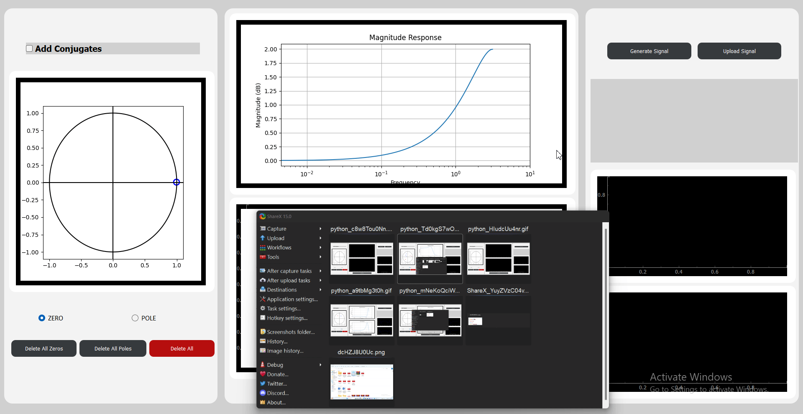
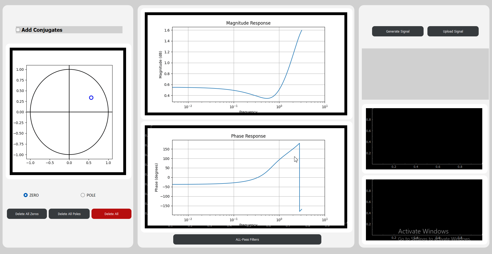

# Digital-Filter-Designer
## Table of Contents
- [Introduction](#introduction)
- [Features](#features)
- [Installation](#installation)
- [Usage](#usage)
- [Contribution](#contribution)

## Introduction
This desktop application allows users to design custom digital filters by placing zeros and poles on the z-plane. Users can visualize the filter's frequency response and apply the designed filter to real-time signals. Additionally, the application provides tools to correct for phase distortion using All-Pass filters.

## Features
**Interactive Z-Plane Plot:**
- Users can place zeros and poles on the z-plane.
- Modify the positions of zeros/poles by dragging them.


- Delete zeros or poles by clicking on them.
- Clear all zeros, all poles, or all elements.


- Option to add conjugates for complex elements.
- Drag the pair of conjugates simultaneously
- Delete tha pair of conjugates together


**Real-Time Filtering:**
- Users can generate and input an arbitrary real-time signal by moving the mouse on a small padding area.
- The speed of mouse movement dictates the frequency content of the generated signal, with faster motion resulting in higher frequencies and slower motion resulting in lower frequencies.
- Low pass filter:


- High pass filter:



**All-Pass Filters:**
- Library of All-Pass filters for correcting phase distortion.
- Option to add All-Pass filters to the original design.
- Custom-built All-Pass filter: Users can input arbitrary parameters to create a custom All-Pass filter.



 ## Installation 
1. Clone the repository
```sh
   git clone https://github.com/camelliamarwan/Digital-Filter-Designer.git
 ```
2. Install project dependencies
```sh
   pip install PyQt5
   pip install pandas
   pip install numpy
   pip install pyqtgraph
   pip install matplotlib
 ```
3. Run the application
```sh
   python main.py
```

## Usage
- Upon launching the application, you'll be presented with the main interface.

- Use the Z-Plane plot to design your filter by placing zeros and poles. Make adjustments as needed.

- Visualize the frequency response of your filter using the provided graphs.

- Apply the designed filter to real-time signals. Control the filtering speed using the slider.

- Correct for phase distortion by adding All-Pass filters from the library or creating custom ones.

## Contribution
  ### **Our Team :**
- Camellia Marwan
- Hager Samir
- Farah Ossama
- Malak Nasser
